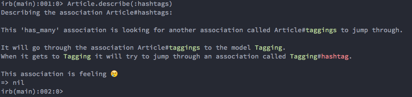
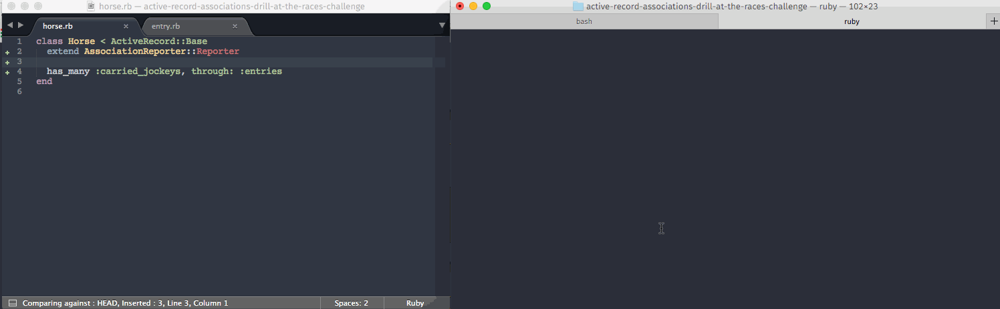

# Association Reporter

Association Reporter wraps the ActiveRecord reflection API, and allows you to describe associations on ActiveRecord models. The description includes a detailed report of the assumptions ActiveRecord is making about your models and associations. It will tell you what it's trying to guess, and when those guesses appear to be wrong!

## Install

Association Reporter can be installed as a gem:

```text
gem install association-reporter
```

## Usage

To use AssociationReporter, extend your model with `AssociationReporter::Reporter`.

```ruby
require "association-reporter/reporter"

class Article
  extend AssociationReporter::Reporter
  has_many :taggings
  has_many :hashtags, through: :taggings
  has_many :comments
  belongs_to :author, class_name: "User"
end
```

Load your models up in an IRB session, or simply write a runner file, and try out the newly added `::describe` method.

```ruby
Article.describe(:hashtags)
```

Colorized output will tell you which guesses succeeded and which guesses failed:



In the example above, it appears our `has_many :through` needs us to specify a source, because it couldn't guess the source name on the `Tagging` model.

## Demo



## Additional Information

The `rake play` task will boot a REPL with a few models loaded from `spec/factories` so you can try this out.

Templates for the output are in `templates`, they're just ERB files.

The `watch` command in the demo supports both color and emoji. You'll find the port by @whit537 [here](https://github.com/whit537/watch).

## Caveats

This is brand new and probably full of bugs, inaccuracies, and scary things that go bump in the night. PRs are warmly welcomed!
